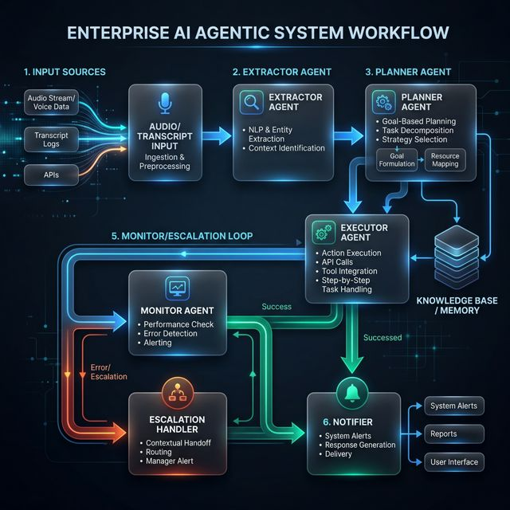

# AutoExec: Enterprise Meeting-to-Execution Engine 🚀

AutoExec is a high-performance, autonomous agentic system designed to transform meeting transcripts into actionable enterprise tasks. It leverages **LangGraph** for resilient multi-agent orchestration and **Gemini 2.5 Flash** for high-accuracy audio transcription and intent extraction.

## 🏗️ Architecture: Multi-Agent Orchestration
The system follows a directed acyclic graph (DAG) structure, separating concerns across specialized agents:
- **Extractor Agent**: Identifies core decisions and context from raw transcripts.
- **Planner Agent**: Generates structured `PlannedTask` objects with owners, priorities, and deadlines.
- **Executor Agent**: Performs the heavy lifting (simulated CRM updates/real email dispatch via Resend).
- **Monitor Agent**: A safety governor that handles real-time execution health checks.
- **Escalation Agent**: Implements "Self-Healing" by routing failed tasks for retry or human review.
- **Verifier Agent**: Conducts a final QA check on task outputs.
- **Notifier Agent**: Validates output quality and notifies stakeholders.

## 📊 System Architecture & Agent Flow

The following diagram illustrates the autonomous decision-making loop and the multi-agent orchestration managed by **LangGraph**.



### 🤖 Agent Roles & Communication
1.  **Extractor Agent (Ingestion)**: 
    - **Role**: Context Window Optimization.
    - **Logic**: Filters noise from transcripts and identifies high-intent language using the Gemini 2.5 Flash `reasoning` engine.
2.  **Planner Agent (Strategy)**: 
    - **Role**: Task Decomposition.
    - **Logic**: Maps decisions to owners and priorities. Communicates via the `PlannedTask` Pydantic schema to ensure downstream type safety.
3.  **Executor Agent (Action)**: 
    - **Role**: External Integration Hub.
    - **Logic**: Interfaces with the **Resend API** for real-world dispatch. It updates the database in real-time to provide UI feedback.
4.  **Monitor Agent (Guardrail)**: 
    - **Role**: Quality Assurance & Feedback.
    - **Logic**: Polling task status and monitoring for API exceptions or logic-level failures.
5.  **Escalation Agent (Recovery)**: 
    - **Role**: Self-Healing Logic.
    - **Logic**: Implements back-off and retry strategies. It can also "interrupt" the flow to request human expert intervention if recovery fails.

### 🛠️ Tool Integrations & Error Handling
- **Gemini File API**: Used for efficient processing of large audio files (.m4a, .mp3). 
  - *Error Handling*: Implements a **Wait Loop** that polls the `genai.get_file()` status until the state is `ACTIVE`.
- **SQLAlchemy (Async)**: Provides the persistence layer for the `Audit Trail`.
  - *Error Handling*: Uses async session management to prevent thread-blocking during long AI inference tasks.
- **Msgpack Serialization**: Customized via `LANGCHAIN_CHECKPOINT_ALLOWED_MSGPACK_MODULES` to support the serialization of complex Pydantic models between graph nodes.

---

## 🛠️ Tech Stack
- **Backend**: FastAPI, SQLAlchemy (Async), LangGraph, Pydantic, SQLite.
- **Frontend**: Next.js 16 (App Router), Tailwind CSS 4, Framer Motion, Lucide Icons.
- **AI/LLM**: Google Gemini 2.5 Flash (via `google-generativeai`).
- **Infrastructure**: Resend API (for automated email dispatch).

---

## 🚀 Setup Instructions

### 1. Prerequisites
- Python 3.10+
- Node.js 18+
- [Google AI Studio API Key](https://aistudio.google.com/)
- [Resend API Key](https://resend.com/) (Optional, for real email testing)

### 2. Backend Setup
```bash
# Clone the repository
git clone https://github.com/Abhinav-0709/AutoExec.git
cd AutoExec

# Create and activate virtual environment
python -m venv venv
./venv/Scripts/activate

# Install dependencies
pip install -r requirements.txt

# Configure environment
# Create a .env file in the root:
# GOOGLE_API_KEY=your_gemini_key
# RESEND_API_KEY=your_resend_key
# DEMO_TARGET_EMAIL=your_test_email

# Start the server
python -m uvicorn main:app --port 8000 --reload
```

### 3. Frontend Setup
```bash
cd frontend

# Install dependencies
npm install

# Start the dashboard
npm run dev
```
The application will be available at `http://localhost:3000`.

---

## 📜 Build Process: Commit History
The project was built over an 18-hour intensive development sprint. Below is the verified build trace:

```text
* fix: switch to gemini-2.5-flash and finalize build
* chore: add model diagnosis and testing scripts
* feat: design responsive dashboard with Lucide icons and Framer Motion
* style: add global styles and root layout configuration
* feat: implement LangGraph agent orchestration logic
* feat: initial FastAPI server setup with basic endpoints
* feat: add database operations and initialization scripts
* feat: implement database connection and ORM models
* Initial commit: environment and ignore setup
```

---

## 📊 Evaluation Metrics
- **Autonomy**: Tier-2 Autonomous (Supports full-loop and Human-in-the-loop modes).
- **Auditability**: 100% Traceable (Reasoning and Confidence scores stored for every decision).
- **Resilience**: Integrated Escalation & Recovery logic for failed agent nodes.

---
*Developed as a high-performance demonstration of Agentic Workflows.*
